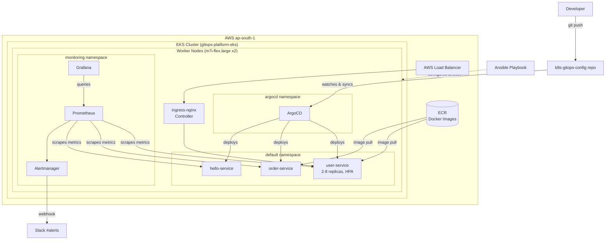
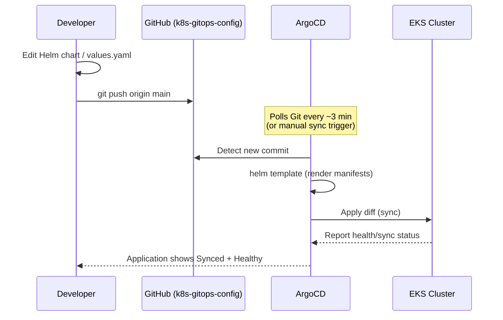

# k8s-gitops-platform

Production-grade Kubernetes platform built for DevOps Institute Mumbai's Capstone Project 5. Demonstrates zero-downtime GitOps deployments, autoscaling, and full-stack observability on AWS EKS.

**Repositories:**
| Repo | Purpose |
|---|---|
| [`k8s-gitops-config`](https://github.com/ishikasharma05/k8s-gitops-config) | Helm charts + ArgoCD Application manifests (what ArgoCD watches) |
| [`k8s-ansible-config`](https://github.com/ishikasharma05/k8s-ansible-config) | Ansible roles for worker-node configuration |
| [`user-service`](https://github.com/ishikasharma05/user-service) | Flask microservice — user data |
| [`order-service`](https://github.com/ishikasharma05/order-service) | Flask microservice — order data |

**Demo video:** _[add your recording link here after upload]_

---

## Architecture



**Infra layer:** EKS cluster and worker nodes provisioned via **Terraform**. Node OS hardening, Docker/containerd setup, and Prometheus/Alertmanager scrape config templating handled via **Ansible** (`k8s-ansible-config`, roles: `node-setup`, `node-exporter`, `prometheus-config`, `alertmanager-config`).

**App layer:** Each microservice is a Flask app, containerized and pushed to **ECR**, packaged as its own **Helm chart** with configurable `values.yaml`.

**Delivery layer:** All deployments happen via **ArgoCD**, which watches `k8s-gitops-config` and auto-syncs the cluster to match Git — no manual `kubectl apply`/`kubectl edit` for application changes.

**Observability layer:** **Prometheus + Grafana + Alertmanager** deployed via the `kube-prometheus-stack` Helm chart, with a custom `PodRestartingTooOften` alert rule routed to Slack.

---

## GitOps Workflow



No developer ever runs `kubectl apply` or `kubectl edit` against application resources directly — every change to `default` namespace workloads goes through a Git commit, and ArgoCD reconciles the cluster to match. `selfHeal: true` also means any manual drift (someone editing a live resource by hand) gets automatically reverted back to what's in Git.

---

## Deployment Guide

### Prerequisites
- AWS CLI configured, Terraform, Ansible, kubectl, Helm, Docker installed
- An EKS cluster provisioned via Terraform (see infra repo)

### 1. Configure worker nodes
```bash
cd k8s-ansible-config
ansible-inventory -i inventory/aws_ec2.yml --graph   # confirm nodes are discovered
ansible-playbook -i inventory/aws_ec2.yml site.yml --ask-vault-pass
```

### 2. Point kubectl at the cluster
```bash
aws eks update-kubeconfig --region ap-south-1 --name gitops-platform-eks
kubectl get nodes
```

### 3. Install ArgoCD
```bash
kubectl create namespace argocd
kubectl apply -n argocd -f https://raw.githubusercontent.com/argoproj/argo-cd/stable/manifests/install.yaml
kubectl get pods -n argocd
```

### 4. Install ingress-nginx
```bash
helm repo add ingress-nginx https://kubernetes.github.io/ingress-nginx
helm install ingress-nginx ingress-nginx/ingress-nginx --namespace ingress-nginx --create-namespace
```

### 5. Install the monitoring stack
```bash
helm repo add prometheus-community https://prometheus-community.github.io/helm-charts
helm install kube-prometheus-stack prometheus-community/kube-prometheus-stack \
  --namespace monitoring --create-namespace
```

### 6. Deploy applications (GitOps — one-time bootstrap only)
```bash
kubectl apply -f k8s-gitops-config/argocd-apps/hello-service-app.yaml
kubectl apply -f k8s-gitops-config/argocd-apps/user-service-app.yaml
kubectl apply -f k8s-gitops-config/argocd-apps/order-service-app.yaml
```
From this point forward, all application changes are made by editing the Helm chart in `k8s-gitops-config` and pushing to `main` — ArgoCD handles the rest.

### 7. Set up namespaces + RBAC
```bash
kubectl apply -f k8s-gitops-config/rbac.yaml
```

---

## Monitoring Runbook

### Accessing dashboards
```bash
# ArgoCD UI
kubectl port-forward svc/argocd-server -n argocd 8080:443
kubectl -n argocd get secret argocd-initial-admin-secret -o jsonpath="{.data.password}" | base64 -d
# → https://localhost:8080  (user: admin)

# Grafana
kubectl port-forward svc/kube-prometheus-stack-grafana 3000:80 -n monitoring
kubectl get secret --namespace monitoring -l app.kubernetes.io/component=admin-secret -o jsonpath="{.items[0].data.admin-password}" | base64 --decode
# → http://localhost:3000  (user: admin)
```

### Key dashboards
- **Kubernetes / Compute Resources / Cluster** — cluster-wide CPU/memory overview
- **Kubernetes / Compute Resources / Namespace (Pods)** — per-service (per-pod) CPU/memory, filter by `default` namespace

### Alerting
- **Rule:** `PodRestartingTooOften` — fires when any pod restarts more than 3 times within a 5-minute window (`k8s-gitops-config/pod-restart-alert.yaml`)
- **Route:** Alertmanager → Slack `#alerts` channel via incoming webhook (configured in `k8s-gitops-config/alertmanager-values.yaml`)
- **Verify alert delivery:**
```bash
kubectl get prometheusrule -n monitoring | grep pod-restart
kubectl get pods -n monitoring | grep alertmanager
```

### Checking service health
```bash
kubectl get applications -n argocd          # ArgoCD sync status, all apps
kubectl get pods -n default                 # running services
kubectl get hpa -n default                  # autoscaling status
kubectl top pods -n default                 # live CPU/memory
```

### Troubleshooting a stuck ArgoCD sync
```bash
kubectl describe application <app-name> -n argocd   # shows ComparisonError details if Helm template fails
helm template k8s-gitops-config/apps/<service>       # render locally to catch YAML/templating errors before pushing
```

---

## Kubernetes Resources Used
Deployments, Services, Ingress, ConfigMaps, Secrets, HorizontalPodAutoscaler, Namespaces, Roles/RoleBindings (RBAC), PrometheusRule (CRD) — across `default`, `staging`, `production`, `argocd`, `monitoring`, and `ingress-nginx` namespaces.